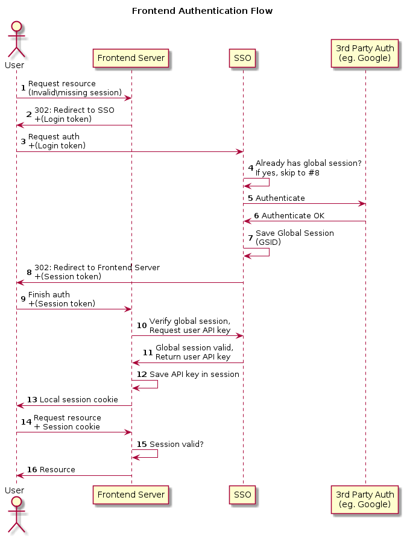
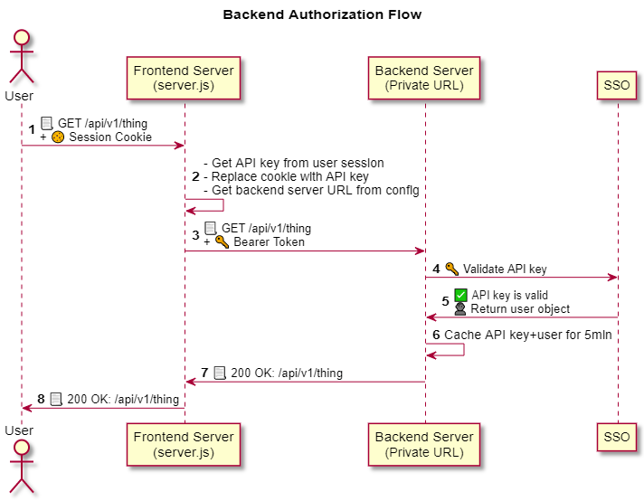

# Authentication in ModTools v2

- [Authentication in ModTools v2](#authentication-in-modtools-v2)
  - [Angular UI](#angular-ui)
  - [API](#api)
  - [Frontend Auth Flow](#frontend-auth-flow)
  - [Backend API Flow](#backend-api-flow)
  - [Why...](#why)
    - [Don't we just send the API key to the frontend?](#dont-we-just-send-the-api-key-to-the-frontend)
    - [Don't we just talk directly to the API?](#dont-we-just-talk-directly-to-the-api)
  - [Setup](#setup)
  - [Bypass SSO Setup](#bypass-sso-setup)

Authentication is managed by the Single Sign-On Server ("SSO") at sso.twohat.io.

It is configured to allow you to login to your localhost instance with your "production" credentials.

⚠ **The ModTools v2 Angular UI must never communicate directly with backend APIs. See below for why not.**

## Angular UI

Cookies are used to store session information. [server.js](../server.js) performs authentication and stores a local session in a Redis cache.

Implementation logic is inherited through the `authHelpers` component provided by `@two-hat-engineering/shared-libs-node`.

## API

[server.js](../server.js) captures all requests to `/api/*`, replaces your session cookie with an API key associated to your account, and proxies the request to the API server through a cluster-local connection.

If you need to communicate with the API server directly through a tool like Postman, you provide your API key via bearer token.

eg.

```
Authorization: Bearer AAABBBCCC111222333
```

At the moment, there is no UI or endpoint to get your API key. To get your API key, contact one of the senior developers on the project. At the time of this writing, that's [@shane.lawrence](https://gitlab.com/shane.lawrence).

## Frontend Auth Flow



This flow works both in production and development environments.

1. Anonymous user tries to access the app. There is no session cookie, or it has expired.
1. The frontend server ([server.js](../server.js)) redirects the user to the SSO service with a special login token.
1. The user completes the SSO login challenge.
1. SSO redirects the user back to the frontend server with an authentication token containing a Global Session ID (GSID).
1. The local server:
   1. creates a local session with a short expiration (1 hour),
   2. gets the user's API key from SSO and saves it in their session, and
   3. occasionally contacts SSO to ensure the GSID is valid.
1. The user is now authenticated.

## Backend API Flow



The Angular app needs to contact a backend API.

1. The request is sent to `/api/*` on the same origin as the app. This is handled by [server.js](../server.js).
2. The frontend server captures the request and:
   - Removes the `Cookie` header  
     (API endpoints use Bearer auth)
   - Adds an `Authorization` header with the user's API key  
     (The key is stored on the server with the user's session and is never sent to the frontend.)
   - Proxies the request to the appropriate API backend over an internal URL
   - Returns the response back to the Angular app

## Why...

### Don't we just send the API key to the frontend?

- API keys are long-lived and difficult to revoke in case of a leak.
- Secrets can't be safely hidden in frontend storage.
- OWASP guidelines require sessions to expire after inactivity. This can't happen with API keys.

### Don't we just talk directly to the API?

- This would add unnecessary complexity to the APIs as they'd need to:
  - Learn what sessions/cookies are, which is not a common pattern for API services,
  - Support both API key auth (for other APIs to auth without a user session) and cookie auth (for user sessions).
- Our auth scheme closely mirrors (and will eventually become) OAuth 2.0, which does not support this.
- We need to target different endpoint URLs in different environments (Azure, Amazon, production, staging). This is much easier to do server-side.

## Setup

1. Follow the steps in _Angular App_
2. Run `docker-compose -f docker-compose.debug.yml` to start the local Redis server
3. Request `development.yaml` from another developer and place it in the `config` folder. **DO NOT TRACK THIS FILE IN GIT**
4. Run `ng build` to build the Angular app and place it in the `dist` folder.
5. `npm start`

## Bypass SSO Setup

It is possible to bypass SSO for development environments, though we do not recommend it.

You will need your personal API key to be able to bypass SSO.

1. Create or update `config/development.yaml`
2. Add the following config value:  
```yaml
dev:
  apiKey: (your API KEY)
```
3. Run `npm start` with the following environment variables set:
   * `NODE_ENV = development`
   * `DISABLE_SSO = true`
4. As `server.js` starts, you should see a warning telling you that SSO is disabled.